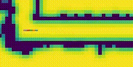

# Hierarchical Planning for Indoor Mobile Robots in a Dynamical Environment
Autonomous Mobile Robots are gradually becoming a reality in many applications. The most
important Decision Making module that goes into it is Planning and Navigation. This work
tries to implement a Hierarchical Planning algorithm to navigate around Dynamic Obstacles.
First, a Global Planner operates on a low resolution Occupancy Grid, using the A* algorithm,
to create a high level plan in the form of waypoints that the bot should follow. A Local Planner
then operates within the high resolution perceptive field around the bot to plan for
uncertainties in the present state. The Local Planner uses an Ego-Graph approach to generate
locally optimal paths described by Motion Primitives that are easy to follow and optimized for
various cost functions like cross track error and curvature error. Dynamic Obstacles are
handled by forward propagating the current motion of said obstacles and then performing a
collision check through time. The aim is to reach the goal moving from waypoint to waypoint
while avoiding static and dynamic obstacles. Algorithms to reject unnecessary waypoints are
also used. All of the above is simulated and tested using a Differential Drive based Indoor
Mobile Robot. [Read Report](ED18B027_Final_Report.pdf)

## TurtleBot3 World Static

## ED Floor Static

## ED Floor with Dynamic Obstacles

## Implementation Flow Diagram

## Collision Checking in Time

## Dynamic Obstacle Tracking using [obstacle_detector](https://github.com/tysik/obstacle_detector)

